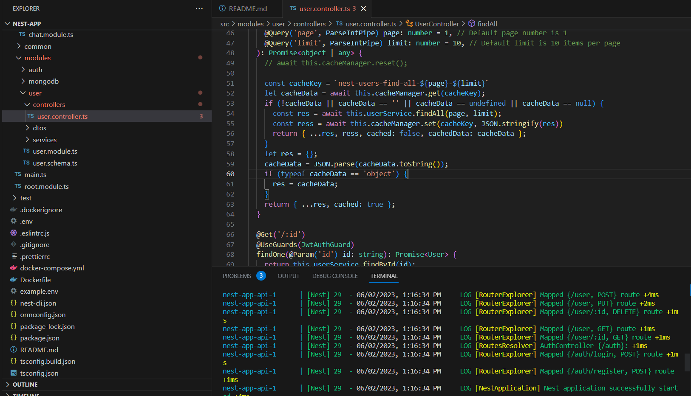

# User CRUD, Login, Register, and WebSocket Chat App

This is an example application that provides User CRUD operations, Login and Register functionality, and a WebSocket Chat service. It is built using the following technologies:

- Docker Container
- Nest.js
- Node.js v18.0
- MongoDB
- Nest Cache Manager
- Pagination for the getAll Users API

## Installation

### Installation using Video
[https://vimeo.com/832616806/cfccc3233a](https://vimeo.com/832616806/cfccc3233a)
[](https://vimeo.com/832616806/cfccc3233a)

### Manual Installation

1. Ensure that you have Node.js v18.0 or later and MongoDB installed on your machine.

2. Clone this repository:

```bash
# Take Clone from Repository
$ git clone https://github.com/Hemantkumawat/nest-chat
```

3. Navigate to the project directory:
```bash
$ cd user-crud-app
```

4. Install the dependencies:
```bash
$ npm install
```

5. Create an environment file:
```bash
$ cp example.env .env
```

6. Edit the .env file and provide the necessary environment variables. For example, you may need to update the DATABASE_URL and JWT_SECRET variables.

7. Start the application:
```bash
$ npm run start:dev
```

8. The application should now be running on `http://localhost:3000.`


### Docker Container Installation
1. Ensure that you have Docker installed on your machine.
2. Clone this repository:
```shell
$ git clone https://github.com/Hemantkumawat/nest-chat
```
3. Navigate to the project directory:
```shell
$ cd user-crud-app
```
4. Build and start the Docker containers:
```shell
$ docker-compose up -d
```
5. The application should now be running on `http://localhost:3000.`

### Postman Workspace/Collection Setup
1. Take pull/download from [[Postman Collection](https://www.postman.com/hemantind007/workspace/nest-app-development/overview)](https://www.postman.com/hemantind007/workspace/nest-app-development/overview)
2. import Postman collections and environment variables
3. run it as per documentation
4. Follow [https://documenter.getpostman.com/view/11562025/2s93sW7F4K](https://documenter.getpostman.com/view/11562025/2s93sW7F4K) Api Collection for more detailed Explaination
   
###Usage
#####Once the application is up and running, you can access the following endpoints:
- User CRUD Endpoints: 
  - Create a new user: `POST /user`
  - Update a user: `PUT /user/:id`
  - Delete a user: `DELETE /user/:id`
  - Get all users: `GET /user`
  - Get a user by ID: `GET /user/:id`
- Authentication Endpoints:
    - User login: `POST /auth/login`
    - User registration: `POST /auth/register`
- WebSocket Chat:
  - The WebSocket Chat service is available on the /chat route.
  
Make sure to replace `http://localhost:3000` with the appropriate hostname and port if you are running the application on a different server.

Contributing
Feel free to contribute to this project by creating pull requests or reporting issues on the [GitHub repository]([abcd.com](https://github.com/Hemantkumawat/nest-chat))

License
This project not under any licence.
